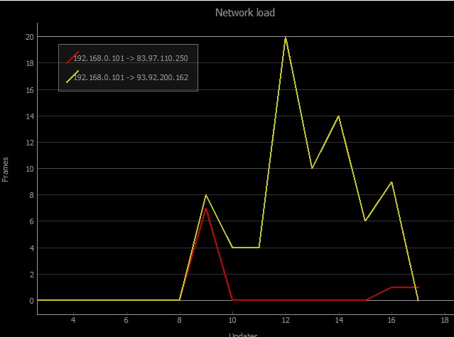

# Sniffer
### Утилита для анализа сетевого траффика
Версия 1.0
Автор: Даниил [JazzMutant](https://t.me/JazzMutant) Толстоухов

## Описание
Данная утилита предназначена для перехвата, анализа и воспроизведения Ethernet трафика. 
Поддерживается возможность сохранения перехваченных данных на диск в формате [".pcap"](https://en.wikipedia.org/wiki/Pcap).

## Режимы работы 
Перед запуском убедитесь, что у вас установлены необходимые библиотеки. 
Для этого можно выполнить команду `pip install -r requirements.txt`
Для запуска введите в консоли `python sniffer.py <args>`

- **Режим захвата трафика**
    Утилита позволяет выбрать интерфейс, с которого будет производиться захват трафика.
    
    - Ключ `-c` или `--console` активирует вывод декодированного трафика на консоль.
    
        **Поддерживаемые форматы для отображения:**
        - Ethernet II Frame
        - IPv4 Packet
        - IPv6 Packet
        - ARP Packet
        - TCP Segment
        - UDP Segment
    
        Данные, не подходящие под укзанные форматы будут обрабатываться, но не отображаться.
    
    - Ключ `-p` или `-plot` позволяет анализировать нагрузку на сеть, указывая отслеживаемые соединения.
        В новом окне строится график по исходным данным.
    
        
    
        Каждое отслеживаемое соединение записывается в новой строке как два IP-адреса через пробел.
        Для отслеживания всего трафика введите "ALL" вместо IP-адресов
        Для того, чтобы завершить ввод отслеживаемых соединений, введите пустую строку
    
    - Ключ `-d` или `-dump` активирует сохранение захваченного трафика на диск в формате ".pcap"
        Данные сохраняются в папку `dump/`. 
        Формат имени файлов:
        `#N dd.mm.yyyy_hh.mm.ss source_ip -to- target_ip.pcap`
        Перехваченные данные каждого отслеживаемого соединения записываются в отдельный файл
        
    
    Для выхода из приложения нажмите `Space`
    
    
    
- **Режим воспроизведения трафика**
    
    - Ключ `-s` или `--send` позволяет воспроизвести трафик из .pcap файла, сохраненного в папке `dump/` на выбранном интерфейсе.

## Состав
- Приложение: `sniffer.py`
- Модули для захвата и обработки трафика: `unpacker/`
- Модули для отслеживания нагрузки на соединениях и построения графиков: `network_analyzer/`
- Модули для воспроизведения трафика: `frame_sender/`
- Модули для отображения декодированной информации и записи ее на диск: `printer/` 
- Модули для конфигурирования и изменения режимов работы: `settings/` 
- Тесты: `tests/`

## Требования
- Операционная система Windows или Linux.
- hexdump
- PyQt5
- pyqtgraph
- readchar
- scapy (Только для Windows)
- [NPCAP (Только для Windows)](https://nmap.org/npcap/)
        

## Стадии разработки
- [x] Базовый консольный сниффер
- [x] Отслеживание нагрузки на соединение и построение графиков
- [x] Запись трафика в pcap-файл
- [x] Возможность воспроизводить pcap-файлы

## Подробности реализации
В папке `unpacker/` находятся модули, отвечающие за получение/передачу фреймов и их декодирование. 
Интерфейсом работы с фреймами служат сокеты `linux_socket.py` и `windows_socket.py`, выбираемые в зависимости от платформы.
Модули, отвечающие за парсинг:
- `frame.py` 
- `packet.py`
- `segment.py`

Папка `printer/` содержит в себе модуль `data_printer.py`, отвечающий за вывод декодированной информации в консоль 
и модуль `pcap_writer.py`, записывающий перехваченный трафик в формат ".pcap". Информация записывается сначала в буфер,
размером 8192 байта, потом на диск.

`network_analyzer/` отвечает за отслеживание нагрузки на соединение и построение графиков.
`tracking_connection.py` умеет проверять, относится ли переданный ему пакет к отслеживаемому соединению, 
инициализируемому парой ip-адресов. Также здесь находится лист `packet_count`, содержащий количество пакетов соединения
на каждую единицу времени (на каждое обновление). Если активен режим записи в файл, то при удачной проверке пакета, 
содержимое передается в `PCAPWriter` и записывается в дамп.

`network_load_plot.py` и `plot_handler.py` представляют собой модуль, инициализирующий график нагрузки, строящийся на основании нескольких
отслеживаемых соединений и модуль, управляющий обновлением графика. По-умолчанию обновление происходит 1 раз в 5 секунд.

В папке `frame_sender/` расположены `pcap_reader.py` -- модуль, декодирующий выбранный pcap-файл 
и `frame_sender.py` - модуль, отправляющий декодированные фреймы на выбранный интерфейс, используя ранее проинициализированный сокет.

Папка `settings/` содержит модуль `mode_parser.py`, позволяющий выбрать интерфейс, создать отслеживаемое соединение,
создать сокет, доступный на данной платформе, а также получить список ключей из аргументов запуска. 

На основные модули написаны тесты. Найти их можно в папке `tests/`

    -------------------------------------------------------------
    Name                                      Stmts   Miss  Cover
    -------------------------------------------------------------
    frame_sender\frame_sender.py                 12      1    92%
    frame_sender\pcap_reader.py                  31      1    97%
    network_analyzer\network_load_plot.py        31      2    94%
    network_analyzer\plot_handler.py             19      2    89%
    network_analyzer\tracking_connection.py      28      1    96%
    printer\pcap_writer.py                       41      1    98%
    settings\mode_parser.py                      68     19    72%
    sniffer.py                                   88     41    53%
    unpacker\socket_handler.py                    7      2    71%